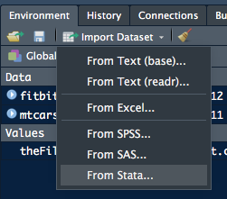

**Data acquisition tools are built into `R`**, which makes it extremely easy to access large pools of publicly-available statistical data pools that have been assembled by governments, research centres, corporations, business associations, non-profit organisations, and individuals.

Data can be harvested from:

* **Plain text and delimited files** (`.txt`, `.csv`, `.tsv`)
* **Microsoft Word and Excel files** (`.doc`, `.docx`, `.xls`, `.xlsx`)
* **Data contained within databases** (SQLite, MySQL, Microsoft Access)
* **Data in statistical software** (SAS, SPSS, NCSS, Octave)

The data sources can be located:

  * **in `R` and `R packages`**
  * **on your computer storage**
  * **on a local or linked network**, or
  * **anywhere on the global Internet**

## Built-In `R` Datasets

**An `R` installation includes many built-in datasets**. These are contained in the package `datasets` and are available at all times. They can be listed with the command:

```{r, eval = FALSE}
data()
```

Specific datasets can be loaded using the same `data()` function and its structure inspected using `head()`:

```{r}
data("USArrests")
head(USArrests)
```

## Datasets In Packages

**Many packages also contain their own datasets**. A package must be installed and loaded before its dataset is available. You can see a comprehensive listing of the datasets included in all installed packages with the command:

```{r, eval = FALSE}
data(package = .packages(all.available = TRUE))
```

**Packages will be listed in alphabetical order** followed by the datasets they contain. You will be surprised to see how many datasets are available for your use! Due to changes in dataset organisation in recent `R` versions, you may see in Console:

```
Warning messages:
1: In data(package = .packages(all.available = TRUE)) :
  datasets have been moved from package 'base' to package 'datasets'
2: In data(package = .packages(all.available = TRUE)) :
  datasets have been moved from package 'stats' to package 'datasets'
```

**To import and inspect a dataset contained in a package**:

```{r}
data(diamonds, package='ggplot2')
head(diamonds)
```

## Importing Delimited Data

**[Delimiter-separated](https://en.wikipedia.org/wiki/Delimiter-separated_values) data files are plain text files** in which the data is arranged in **rows**, each row **containing data items separated by a delimiter** and the row **ended by a `<NEWLINE>`**. The first row of data is usually the column headings.

**These are the most basic type of dataset** as being plain text, they are cross-platform and can be opened by any text editor. Most database and spreadsheet programs are able to read or save data in a delimited format.

**The most common data delimiters are**:

* **Comma-Separated Values** (CSV -- `.csv` file extension)
* **Tab-Separated Values** (TSV -- `.tsv` file extension)
* **Any other ASCII character** (colon `:`, pipe `|`, etc.)
* **Designated ASCII [Control characters](https://en.wikipedia.org/wiki/Control_character#Data_structuring)**.

If the data items consist of multiple words or characters separated by punctuation or spaces, each data item must be contained within pairs of single `'<ITEM>'` or double `"<ITEM>"` quotes.

### Using [`read.table`](https://www.rdocumentation.org/packages/utils/versions/3.5.0/topics/read.table)

**`read.table` is part of `R`'s built-in `utils` package**. It's the easiest way to import delimited data files, and **results in a [_data.frame_](R_Programming.html#dataframes)**.

Here are the first six lines of a `.csv` file containing **data from a [Fitbit tracker](https://www.fitbit.com/en-ca/charge2)**. It is called `fitbit-activity.csv` and is **located in the `docs` directory of this project**:

```{r}
theFile <- "docs/fitbit-activity.csv"
fitbit <- read.table(file=theFile, header=TRUE, sep=",")
head(fitbit)
```

**`read.table` has three arguments**:

* **The path and filename or URL** of the data file;
  * Path can be _absolute_ or _relative_ to the current _working directory_;
* **Whether the first line contains the column header labels**;
  * set to TRUE if _and only if_ the first row contains one fewer fields than the number of columns; and
* **The separator between data items**.
  * If not set, the default is `""` white space, meaning one or more spaces, tabs, newlines or carriage returns. This can be set to `\t` (_<TAB>_) or `;` (semicolon) as appropriate.

**Documentation of `read.table` can be viewed with**:

```{r}
?read.table
```

**Two important arguments are**:

* **`as.is`** -- the default behavior of `read.table`, **converts _character_ variables to _factors_**, while
* **`stringsAsFactors`** -- `TRUE` or `FALSE` **can be used to prevent this**, although `as.is` and `colClasses`, which sets the [_data type_](R_Programming.html#data-types) for each column, will override it (see the documentation).

#### Pre-set Wrappers

`read.table` has wrappers pre-set for different file delimiters:

Function | separator | decimal
---- | ---- | ----
read.table | empty| period 
read.csv | comma | period 
read.csv2 | / | comma 
read.delim | &bsol;t | period 
read.delim2 | &bsol;t | tab 

If you know the delimiter, using one of these is the easiest way to import those files.

**`read.table` is slow to read large files into memory**. Two other packages provide function that are faster and better in that they do not automatically convert [_character data_ to _factors_](R_Programming.html#character-data-types):

* [`read.delim`](https://www.rdocumentation.org/packages/readr/versions/1.1.1/topics/read_delim) from the [`readr`](https://www.rdocumentation.org/packages/readr/versions/1.1.1) package by [Hadley Wickham](http://hadley.nz/), and
* [`fread`](https://www.rdocumentation.org/packages/data.table/versions/1.11.2/topics/fread) from the [`data.table`](https://www.rdocumentation.org/packages/data.table/versions/1.11.2) package by [Matt Dowle](https://www.linkedin.com/in/mattdowle).

### Using [`readr`](https://readr.tidyverse.org/)

The [`readr`](https://readr.tidyverse.org/) package handles many kinds of delimited text files:

* `read_csv()` -- comma separated (CSV) files
* `read_tsv()` -- tab separated files
* `read_delim()` -- general delimited files
* `read_fwf()` -- fixed width files
* `read_table()` -- tabular files where colums are separated by white-space.
* `read_log()` -- web log files

**`readr` is much faster than `read.table`**, and it also removes the need to set `stringsAsFactors` to `FALSE` since that argument does not exist in `readr`, which leaves strings "as-is" by default. It also shows a helpful progress bar with very large files.

Let's open the same `fitbit-activity.csv` file with the `read.delim()` function:

```{r}
library(readr)
theFile <- "docs/fitbit-activity.csv"
fitbit <- read_delim(theFile, delim = ",")
```

**`readr` returns data as a [_tibble_](https://github.com/tidyverse/tibble), a modern re-imagining of the [_data.frame_](R_Programming.html#dataframes)**.

**A _tibble_ displays the file's _metadata_ under each column head**, such as the number of rows and columns and the data types of each column. The _tibble_ is also intelligently adjusted to fit the screen.

We can see this by examining the first few rows with `head()`:

```{r}
head(fitbit)
```

**`readr` also has special cases for different delimiters**:

* `read_csv()` -- for commas (`,`)
* `read_csv2()` -- semicolons (`;`)
* `read_tsv()` -- tabs (`\t`)

**More information on `read.delim()` can be found in the `readr` documentation**:

```{r}
?readr::read_delim
```

### Using [`fread`](https://www.rdocumentation.org/packages/data.table/versions/1.11.2/topics/fread)

**The `fread()` function from the `data.table` package** also will also read large data files faster than `read.table`, with the `stringsAsFactors` argument set to `FALSE` by default.

(**You may have to install this package** by entering `install.packages("data.table")` in the _Console pane_).

```{r}
library(data.table)
theFile <- "docs/fitbit-activity.csv"
fitbit <- fread(theFile, sep = ",", header = TRUE)
fitbit
```

**`fread` produces a `data.table`, an extension of [`data.frame`](R_Programming.html#dataframes)**. You can see the documentation for this [_data structure_](R-Programming.html#data_structures) by entering `?data.frame` in the _Console_. 

### Using RStudio



**RStudio has tools to import delimited data**. These are accessible from the _Import Dataset_ tab of the _Environment pane_. 

The two tools for plain-text delimited files are:  
<span style="padding-left: 1em; list-style-position: inside">
<ul>
  <li>**From Text (base)...** -- using base R</li>
	<li>**From Text (readr)...** -- using `readr`</li>
</ul>
</span>

Instructions on their use can be found [here](https://support.rstudio.com/hc/en-us/articles/218611977-Importing-Data-with-RStudio).

## Importing Excel Data

**Prior to the more widespread use of [`R` for Data Science](R_Data_Science.html)**, data was compiled in [spreadsheets](https://en.wikipedia.orgwiki/Spreadsheet), mostly in **[Microsoft Excel](https://en/wikipedia.org/wiki/Microsoft_Excel), intially released in 1987.**

**Excel has a very different data structure from that required by `R`**, and until recently it was difficult to bring Excel data sets into `R`.

**The [`readxl`](https://readxl.tidyverse.org/) package by [Hadley Wickham](http://hadley.nz/) has changed this**, making it easy to **import data from a single Excel sheet** into an `R` project. However, the file must be present on the local computer.

**`fitbit-export.xlsx`, a record of daily activities and nocturnal sleep**, is available in the `docs/` directory of this project.

**It can be brought into `R` after you have loaded the `read_excel` package** by entering `install.packages("read-excel")` in the _Console pane_.

**Note: Depending on your version of `R`**, you may have to install the development version by entering `devtools::install_github("tidyverse/readxl")` in the _Console pane_.

**To do this you will first need to install the `devtools` package**, obtained with `install.packages("devtools")`.

First check which _sheets_ are in the Excel file:

```{r}
library(readxl)
excel_sheets("docs/fitbit-export.xlsx")
```

`read_excel` reads one sheet, by default the first, and displays the result as a [_tibble_](https://github.com/tidyverse/tibble):

```{r}
activity <- read_excel("docs/fitbit-export.xlsx")
activity
```

There are two ways of reading the second and subsequent sheets:

* **by sheet number**

```{r}
sleepnumber <- read_excel("docs/fitbit-export.xlsx", sheet=2)
sleepnumber
```

 * **by sheet name**
 
```{r}
sleepname <- read_excel("docs/fitbit-export.xlsx", sheet="Sleep data")
sleepname
```

**Unlike the previous two packages**, `read_excel` cannot grab files from the Internet. They must be downloaded first either by copying and pasting the raw data from a Web browser, or by downloading them using the [`download.file`](https://www.rdocumentation.org/packages/utils/versions/3.5.0/topics/download.file) package.

The command for `download.file` is entered in the _Console pane_, in the format:

```
download.file(url, destfile, method, quiet = FALSE, mode = "w",
              cacheOK = TRUE,
              extra = getOption("download.file.extra"), …)
```

**You can also read the documentation for this package** in the _Viewer pane_ of RStudio by entering `?download.file` in the _Console pane_.

**RStudio's built-in _Import Tools_ also can handle Excel data** ([see above](#using-rstudio)) 

## Importing JSON 

> JavaScript Object Notation (JSON) is an open-standard file format that uses human-readable text to transmit data objects consisting of attribute–value pairs and array data types. It is widely used for asynchronous browser–server communication -- [Wikipedia](https://en.wikipedia.org/wiki/JSON)

**Although JSON files are plain text, they can carry more complex data than delimited text or Excel files**. They can contain nested data as arrays, even arrays within arrays, and because they are plain text they can be **used for browser/server data communication**.

Here's an example of a JSON file:

```
{
    "glossary": {
        "title": "example glossary",
		"GlossDiv": {
            "title": "S",
			"GlossList": {
                "GlossEntry": {
                    "ID": "SGML",
					"SortAs": "SGML",
					"GlossTerm": "Standard Generalized Markup Language",
					"Acronym": "SGML",
					"Abbrev": "ISO 8879:1986",
					"GlossDef": {
                        "para": "A meta-markup language, used to create markup languages such as DocBook.",
						"GlossSeeAlso": ["GML", "XML"]
                    },
					"GlossSee": "markup"
                }
            }
        }
    }
}

```

**A JSON file can be found at `docs/tidepool.json` in this project**. It is a selection from a much larger (1.9GB) JSON file downloaded from the [Tidepool](https://tidepool.org) diabetic data repository, a user-contributed data repository available for diabetes-related Data Science research. This data was originally uploaded to Tidepool from an [Abbott Freestyle Libre](https://myfreestyle.ca/en/) flash glucose monitoring (FGM) meter.

**The `R` package [`jsonlite`](https://github.com/jeroen/jsonlite) was developed specifically to bring JSON data into `R`**. It can be installed by entering `install.library("jsonlite")` in the _Console pane_, after which the library can be loaded and used:

```{r}
library(jsonlite)
tidepool <- fromJSON("docs/tidepool.json")
tidepool
```

To just examine the structure:

```{r}
head(tidepool)
```

**[Getting Started With `jsonlite`](https://cran.r-project.org/web/packages/jsonlite/vignettes/json-aaquickstart.html) is available online and in its vignette**, which you can view in RStudio by entering `??jsonlite` in the _Console pane_ and clicking `jsonlite::json-aaquickstart`.

**A  detailed example of working with JSON files** can be found [here](https://blog.exploratory.io/working-with-json-data-in-very-simple-way-ad7ebcc0bb89).

## Data In R Binary Files

> RDS files are binary files that represent R objects of any kind. They use the `.rdata` extension; can store a single object or multiple objects; and can be passed among Windows, Mac and Linux computers for use in those operating systems.

### Save All Objects

**To explore this, create an RDS file** from the `fitbit` dataframe in memory:

```{r}
save(fitbit, file="docs/fitbit.rdata")
```

**To show the use of the RDS file**, remove `fitbit` from memory:

```{r}
rm(fitbit)
```
**If you test for it presence with `head()`**, you will see the error message:

```
Error in head(fitbit) : object 'fitbit' not found
```

**Restore it from the `fitbit.rdata` file**:

```{r}
load("docs/fitbit.rdata")
head(fitbit)
```

### Save One Object

**The `load()` function stores all the objects in an `RDS` file**, including their names. The **`saveRDS()` function saves just one object** to a binary RDS file, but **without a name**, so when loading it with `readRDS` it must be assigned to an object.

**Create a vector**:

```{r}
MyVector <- c(1 : 5)
MyVector
```

**Save it to an RDS file**:

```{r}
saveRDS(MyVector, file = "docs/myvector.rdata")
```

**Read it to another object**:

```{r}
YourVector <- readRDS("docs/myvector.rdata")
YourVector
```

**Check they are identical**:

```{r}
identical(MyVector, YourVector)
```

### Save Entire Workspace

**The function `save(image)` will save all objects currently in your workspace**. You must use the `.rdata` file extension for this:

```{r}
save.image(file = "docs/workspace.rdata")
```

**The objects can be loaded into a workspace with `load()` function**. These will overwrite existing workspace objects, so you may want to check what they are with:

```{r}
ls()
```

**You can clear all workspace objects with**:


```{r}
rm(list=ls())
```

**You'll see them disappear from the _Environment pane_**. They can be loaded back with:

```{r}
load(".RData")
```

### Save Session

**RStudio saves the current workspace in its `<projectname>.RData` file**. When you quit an RStudio session, you will be asked whether you wish to save the _Session_. This will save both the current variables and functions, so you will be able to pick up where you left off in a subsequent RStudio session.

**However, some advise [not to do that](https://onunicornsandgenes.blog/2017/04/02/using-r-dont-save-your-workspace/)**.

**If you change the _Working Directory_ you will need to `load()` the workspace** to sync it to the new working directory.

**RStudio enables workspace management from the _Session menu_**:

* **Load Workspace...**
* **Save Workspace As...**
* **Clear Workspace...** and
* **Quit Session...**

## Data From Databases

**Most of the available data is held in databases**, including [Microsoft Access](https://en.wikipedia.org/wiki/Microsoft_Access), [Microsoft SQL Server](https://www.microsoft.com/en-us/sql-server), [MySQL](https://www.mysql.com/), or [PostgreSQL](https://www.postgresql.org/). 

**To access a database, an [ODBC](https://en.wikipedia.org/wiki/Open_Database_Connectivity) connection is needed.** Open Database Connectivity (ODBC) is a standard application programming interface (API) for accessing database management systems (DBMS). It is independent of operating systems and can be ported to all platforms.

**[RPostgreSQL](http://www.postgresqltutorial.com/), [RMySQL](https://github.com/r-dbi/RMySQL), [ROracle](http://cran.r-project.org/web/packages/ROracle/index.html), and [RJDBC](http://cran.r-project.org/web/packages/RJDBC/index.html) are database-specific `R` packages**, but if the database you wish to query doesn't have a specifc package, the generic [RODBC](https://www.rdocumentation.org/packages/RODBC/versions/1.3-15) package is available. (Complete documentation [here](https://cran.microsoft.com/web/packages/RODBC/RODBC.pdf) (PDF))

**To help with database connection, the [`DBI` package](https://www.rdocumentation.org/packages/DBI/versions/0.5-1) can be used**.

**DataCamp has two comprehensive tutorials on database connectivity**: [Part1](https://www.datacamp.com/community/tutorials/r-data-import-tutorial) and [Part 2](https://www.datacamp.com/community/tutorials/importing-data-r-part-two).

### Using `RSQLite`

**First install the `RSQLite` and `DBI` packages** by entering `install.packages("RSQLite, DBI")` in the _Console pane_.

```{r}
download.file("https://r.stuzog.com/docs/fitbitactivity.db", destfile = "docs/fitbitactivity.db", mode = "wb")
```

**Now load `RSQLite` and `DBI` packages to access the downloaded database**:

```{r}
library(RSQLite)
library(DBI)
```

**To connect, first specify the driver using the `dbDriver` function **:

```{r}
drv <- dbDriver("SQLite")
class(drv)
```

**Now connect to the `tidepool` database using the `dbConnect` function**:

```{r}
fitact <- dbConnect(drv, "docs/fitbitactivity.db")
class(fitact)
```

**List the tables in `fitbitactivity` database**:

```{r}
dbListTables(fitact)
```

**List the fields in the `fitbitactivity` table**:

```{r}
dbListFields(fitact, name = "fitbitactivity")
```

**Now you are connected to the downloaded database and know its fields**, you can make any SQL query and use `dbGetQuery` to return the result as a [_data.frame_](R_Programming.htmml#dataframes). (For more on `SQL queries`, [W3Schools](https://www.w3schools.com/) has an [SQL Tutorial](https://www.w3schools.com/sql/default.asp).)

**It's a good idea to set `stringsAsFactors` to `FALSE`** to cut processing time and preserve `Character` data as `character` -- `dbGetQuery` has this argument.

**You should close the ODBC connection using `dbDisconnect`**, although it will close automatically when the `R` session closes or you open another connection.

## Data from Web Sites

### In HTML Tables

**Web pages often include data enclosed in an [HTML Table](https://html.com/tables/)**. This data can be captured and examined using the [`XML` package](https://giventhedata.blogspot.ca/2012/06/r-and-web-for-beginners-part-ii-xml-in.h*tml),.

**The `XML` package can parse and generate all types of XML data**. [XHTML](https://www.w3schools.com/Html/html_xhtml.asp) and [HTML5](https://en.wikipedia.org/wiki/HTML5) now 
widely used on the Web are XML-compliant versions of [HTML](https://en.wikipedia.org/wiki/HTML).

**First install the package** by entering `install.packages("XML")` in the _Console panel_, followed by a `RETURN`.

**Use the page URL to access the data inside an HTML table** contained on a Web page. If the page has more than one table, set `which` (see example below) to the order number of the table you want to acquire.

**NOTE: The `readXMLTable` function will NOT work with `https://` URLs**. You must use the `http://` format of a URL only. You can also examine a file on your computer by giving the file path without the URL.

```{r}
library(XML)
theURL <- "http://r.stuzog.com/docs/fitbit-activity-table.html"
fitbtable <- readHTMLTable(theURL, which=1, 
             header=TRUE, stringsAsFactors=FALSE)
fitbtable
```

### In Other HTML Elements

**Not all useful data is contained in HTML tables.** Some may be in ordered or unordered [lists](https://www.w3schools.com/html/html_lists.asp), [`<span>`](https://www.w3schools.com/tags/tag_span.asp)s, or other [HTML elements](https://www.w3schools.com/html/html_elements.asp). How to identfy and extract it?

#### Using `rvest`

**The [`rvest` package](https://github.com/hadley/rvest) was designed by Hadley Wickham to do just this**. Install it by entering `install.packages("rvest")` in the _Console pane_.

**Let's use the [example tutorial](https://github.com/hadley/rvest) by Hadley Wickham**:

```{r}
library(rvest)
lego_movie <- read_html("http://www.imdb.com/title/tt1490017/")
lego_movie
```

**That doesn't tell us too much about the content of the page**, so we need to have [the Lego movie page](http://www.imdb.com/title/tt1490017/) open in our Web browser.

**To find the structure, Wickham recommends the open-source tool [`selectorgadget`](http://selectorgadget.com/)**. You can read his documentation of this useful Web utility by entering `vignette("selectorgadget")` in the _Console pane_.

**He uses `html_node()` to find the first node that matches that selector**, extract its contents with `html_text()`, and convert it to numeric with `as.numeric()`:

```{r}
lego_movie %>%
  html_node("strong span") %>%
  html_text() %>%
  as.numeric()
```

**He suggests a similar process to extract the cast**, using `html_nodes()` to find all nodes that match the selector, converting it to text with `html_text()`:

```{r}
lego_movie %>%
  html_nodes("#titleCast .itemprop span") %>%
  html_text()
```

**Web scraping is an art. Here's a [more advanced tutorial](https://rpubs.com/ryanthomas/webscraping-with-rvest) that may help**.

## From Other Software

**`R` is not the only statistical software**. Proprietary commercial and open-source formats pre-exist the popularity of `R`, provided by [SAS](https://en.wikipedia.org/wiki/SAS_(software)), [SPSS](https://en.wikipedia.org/wiki/SPSS), and [Octave](https://www.gnu.org/software/octave/), among [others](https://en.wikipedia.org/wiki/List_of_statistical_packages).

### Using `foreign`

**The [`foreign`](https://www.rdocumentation.org/packages/foreign/versions/0.8-70) package enables reading data into `R`**, returning it as a `data.frame` --- if it succeeds, which often it does not. It includes the following functions for acquiring data from other statistical software:

| Function | Format |
| :------ | :------ |
| `read.spss` | SPSS |
| `read.dta` | Stata |
| `read.ssd` | SAS |
| `read.octave` | Octave |
| `read.mtp` | Minitab |
| `read.systat` | Systat |

**Note: `read.ssd` normally requires a valid SAS license**, but this can be circumvented by using [Microsoft Machine Learning Server](https://www.microsoft.com/en-us/sql-server/machinelearningserver), which has the [`RxSasData()`](https://docs.microsoft.com/en-us/machine-learning-server/r-reference/revoscaler/rxsasdata) function in its [`RevoScaleR`](https://docs.microsoft.com/en-us/machine-learning-server/r-reference/revoscaler/revoscaler) package.

### Using `haven`

**A Hadley Wickham package called [`haven`](http://haven.tidyverse.org/) is similar to [`foreign`](https://www.rdocumentation.org/packages/foreign/versions/0.8-70)** but uses [`tidyverse`](https://www.tidyverse.org/) conventions and is optimised for speed and convenience. `haven` functions result in a _tibble_ rather than a _data.frame_. They are:

| Function | Format |
| :------ | :------ |
| read_spss | SPSS |
| read_sas | Stata |
| read_stata | Systat |

<p class="bottom-navbar"><span class="bottom-navbar-contents"><span class="glyphicon glyphicon-arrow-left"> </span> [<span class="bottom-navbar-link">Part 2 - Fundamentals of R</span>](R_Programming.html)&nbsp;&nbsp; |&nbsp; [<span class="bottom-navbar-link">Learning Resources</span>](R_Learning_Resources.html)&nbsp; <span class="glyphicon glyphicon-arrow-right"></span></span></p>
